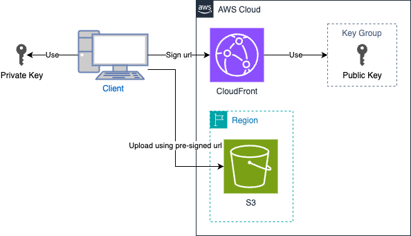

## Introduction

CloudFront supports the feature of generating signed URLs. While S3 also offers similar functionality, **CloudFront provides the added benefit of enabling uploads through your custom domain**, making it especially useful for domain-restricted environments.

Official documentation: [Amazon CloudFront Private Content](https://docs.aws.amazon.com/AmazonCloudFront/latest/DeveloperGuide/PrivateContent.html)

The architecture uses CloudFront as a front-facing service for secure file uploads, enabling custom domain usage and tighter control in restricted environments.



## Specifying Trusted Signers

To begin, you must create a trusted key group for use as a trusted signer.

Official documentation: [Trusted Signers for CloudFront](https://docs.aws.amazon.com/AmazonCloudFront/latest/DeveloperGuide/private-content-trusted-signers.html)

> [!WARNING]
> While you can use your AWS account as a trusted signer, AWS recommends using a key group. Refer to [Choosing Key Groups or AWS Accounts](https://docs.aws.amazon.com/AmazonCloudFront/latest/DeveloperGuide/private-content-trusted-signers.html#choosing-key-groups-or-AWS-accounts) for details.

### Creating Key Pairs

Key pairs must adhere to the following requirements:

- Type: SSH-2 RSA key pair
- Format: Base64-encoded PEM
- Key Size: 2048-bit

Use the following commands to create a key pair:

```shell
openssl genrsa -out private_key.pem 2048
openssl rsa -pubout -in private_key.pem -out public_key.pem
```

## Creating AWS Resources

### CloudFormation Template

[template.yaml](./template.yaml)

Key Points:

- Pass the public key to the `PublicKey` parameter ([line 5](./template.yaml#L5)) and use it ([line 38](./template.yaml#L38)).
- Ensure the S3 bucket policy allows the `s3:PutObject` action ([line 27](template.yaml#L27)).
- Use the [AllViewerExceptHostHeader](https://docs.aws.amazon.com/AmazonCloudFront/latest/DeveloperGuide/using-managed-origin-request-policies.html#managed-origin-request-policy-all-viewer-except-host-header) origin request policy ([line 85](template.yaml#L85)).

Deploy the CloudFormation stack with the following command:

```shell
PUBLIC_KEY=$(cat public_key.pem)
aws cloudformation deploy \
  --template-file template.yaml \
  --stack-name cloudfront-presigned-urls-example \
  --parameter-overrides PublicKey=$PUBLIC_KEY
```

Check the deployed resources:

```shell
aws cloudformation describe-stacks \
--stack-name cloudfront-presigned-urls-example \
| jq ".Stacks[0].Outputs"
```

## Testing

### Generate a Pre-Signed URL

Set the following variables:

```shell
CLOUDFRONT_DOMAIN=<CloudFront domain>
KEYPAIR_ID=<Key pair ID>
UTC_OFFSET=+9
```

Generate a URL:

```shell
PRESIGNED_URL=$(aws cloudfront sign \
--url https://$CLOUDFRONT_DOMAIN/upload-test.txt \
--key-pair-id $KEYPAIR_ID \
--private-key file://private_key.pem \
--date-less-than $(date -v +5M "+%Y-%m-%dT%H:%M:%S$UTC_OFFSET"))

echo $PRESIGNED_URL
# https://<distribution-id>.cloudfront.net/upload-test.txt?Expires=...&Signature=...Key-Pair-Id=...
```

### Upload a File

```shell
echo 'Hello World' > example.txt
curl -X PUT -d "$(cat example.txt)" $PRESIGNED_URL
```

Confirm the file is uploaded:

```shell
aws s3 cp s3://uploaded-files-<AWS::AccountId>-<AWS::Region>/upload-test.txt ./
cat ./upload-test.txt
```

## Cleaning Up

To avoid incurring costs, delete the resources:

```shell
aws s3 rm s3://uploaded-files-<AWS::AccountId>-<AWS::Region>/upload-test.txt
aws cloudformation delete-stack --stack-name cloudfront-presigned-urls-example
```

> [!NOTE]
> Disabling the CloudFront distribution may take several minutes.
